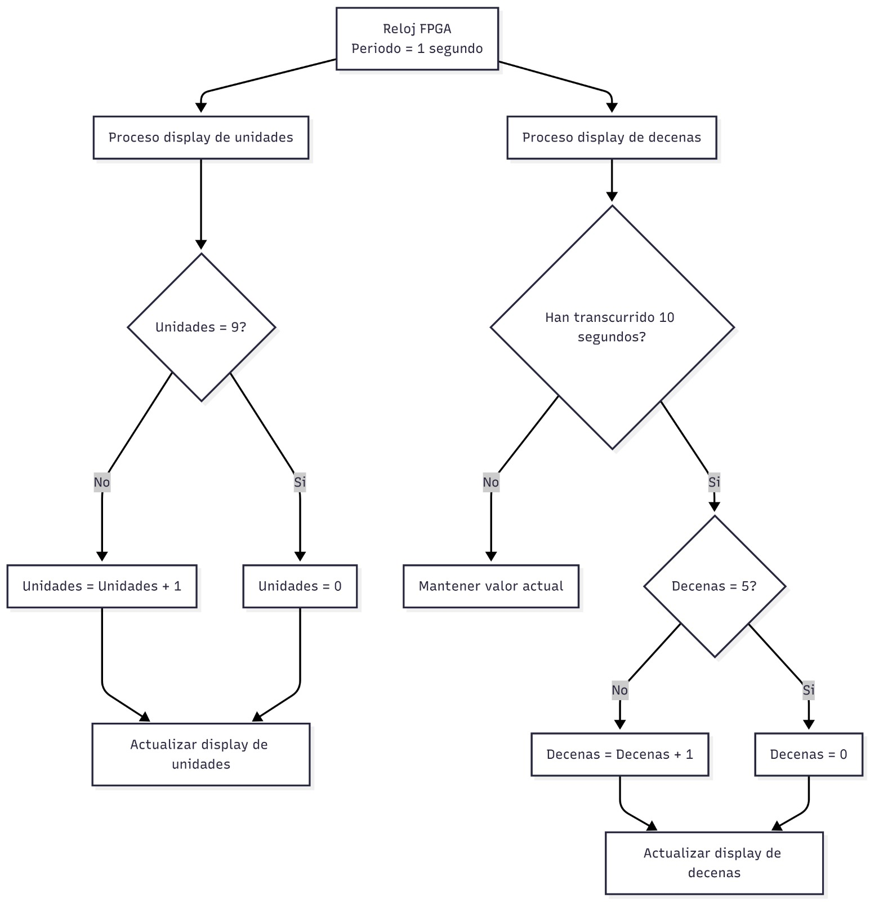

# Contador de 60 Segundos con Displays de 7 Segmentos

Este repositorio contiene la documentación técnica, el diseño y la solución del laboratorio **Implementación de Periféricos**. El proyecto consiste en el diseño de un periférico de hardware que actúa como un contador de segundos síncrono que se reinicia automáticamente cada 60 segundos (de `00` a `59`), utilizando una FPGA y visualizando el resultado en dos displays de 7 segmentos independientes.

El proyecto está estructurado bajo tres dominios fundamentales del diseño electrónico: **Comportamental**, **Estructural** y **Físico**.

---

## 1. Dominio Comportamental

Este dominio define *qué* hace el sistema, sus interfaces y su lógica de control algorítmica, sin entrar en detalles de la implementación del hardware interno.

### Diagrama de Caja Negra

Establece las fronteras del sistema, definiendo claramente las señales de entrada (estímulos y sensores) y las señales de salida (actuadores e indicadores visuales).

* **Entradas:** Reloj maestro (`clk`) de la tarjeta FPGA.
* **Salidas:** Buses de control combinacionales de 7 segmentos independientes para las unidades (`seg_uni[6:0]`) y para las decenas (`seg_dec[6:0]`).


### Diagrama de Flujo

Describe el algoritmo de toma de decisiones y las prioridades del sistema:

1.  **Prioridad 1 (División de Reloj):** El acumulador incrementa con cada flanco ascendente de la señal maestra. Al alcanzar el límite establecido, genera un pulso síncrono de habilitación y limpia el registro.
2.  **Prioridad 2 (Contador de Unidades):** Incrementa bajo la señal del divisor. Al alcanzar el valor binario máximo de `9`, se reinicia inmediatamente a `0` y propaga un acarreo síncrono.
3.  **Prioridad 3 (Contador de Decenas):** Incrementa exclusivamente con el desborde del módulo de unidades. Al alcanzar el valor límite de `5` de manera simultánea con un `9` en las unidades (segundo 59), limpia ambos contadores.



### Tabla de Verdad y Ecuaciones Booleanas

Define la lógica combinacional exacta que rige el sistema. A partir de mapas de simplificación, se obtuvieron las siguientes ecuaciones booleanas simplificadas que dictan el comportamiento de los segmentos de salida ($a, b, c, d, e, f, g$) en función de los bits binarios BCD de los contadores internos ($D_3$, $D_2$, $D_1$, $D_0$):

* $a = D_3 \lor D_1 \lor (D_2 \land D_0) \lor (\\overline{D_2} \land \\overline{D_0})$
* $b = \\overline{D_2} \lor (\\overline{D_1} \land \\overline{D_0}) \lor (D_1 \land D_0)$
* $c = D_2 \lor \\overline{D_1} \lor D_0$
* $d = D_3 \lor (\\overline{D_2} \land \\overline{D_0}) \lor (D_1 \land \\overline{D_0}) \lor (D_2 \land \\overline{D_1} \land D_0) \lor (\\overline{D_2} \land D_1)$
* $e = (\\overline{D_2} \land \\overline{D_0}) \lor (D_1 \land \\overline{D_0})$
* $f = D_3 \lor (\\overline{D_1} \land \\overline{D_0}) \lor (D_2 \land \\overline{D_1}) \lor (D_2 \land \\overline{D_0})$
* $g = D_3 \lor (D_2 \land \\overline{D_1}) \lor (\\overline{D_2} \land D_1) \lor (D_1 \land \\overline{D_0})$


## Diccionario de Señales (Entradas / Salidas)

| Tipo | Variable Lógica | Etiqueta Física | Descripción |
| :--- | :---: | :---: | :--- |
| **Entrada** | `clk` | `clk` | Señal de reloj maestro de la placa FPGA (50 MHz) |
| **Salida** | `seg_uni` | `seg_uni[6:0]` | Bus de salida hacia los segmentos del display de unidades |
| **Salida** | `seg_dec` | `seg_dec[6:0]` | Bus de salida hacia los segmentos del display de decenas |
| **Interna** | `divisor` | `divisor[25:0]` | Registro contador encargado de la división de frecuencia |
| **Interna** | `unidades` | `unidades[3:0]` | Registro contador BCD para el dígito de las unidades (0-9) |
| **Interna** | `decenas` | `decenas[3:0]` | Registro contador BCD para el dígito de las decenas (0-5) |

### Descripción en Lenguaje de Hardware (Verilog)
A partir de las ecuaciones obtenidas, el comportamiento del sistema se describe utilizando el lenguaje de descripción de hardware Verilog. Este código es el que define la lógica que posteriormente será sintetizada en la FPGA:


### Código Fuente (Verilog - Top Module)

```verilog
module top(
    input clk,                // Clock de la FPGA
    output reg [6:0] seg_uni, // Display unidades
    output reg [6:0] seg_dec  // Display decenas
);

   
    // DIVISOR DE FRECUENCIA 
    
    reg [25:0] divisor = 0;

   
    // CONTADORES BCD
    
    reg [3:0] unidades = 0;
    reg [3:0] decenas  = 0;

    
    // GENERAR PULSO DE CONTEO Y LÓGICA SECUENCIAL
    
    always @(posedge clk) begin
        // MODIFICACIÓN: Cambiado de 49999999 a 4 para acelerar la simulación 
        if(divisor == 4) begin
            divisor <= 0;

            // CONTADOR DE SEGUNDOS (Lógica de desborde)
            if(unidades == 9) begin
                unidades <= 0;
                if(decenas == 5)
                    decenas <= 0;
                else
                    decenas <= decenas + 1;
            end
            else begin
                unidades <= unidades + 1;
            end
        end
        else begin
            divisor <= divisor + 1;
        end
    end

    
    // DECODER DISPLAY UNIDADES
    
    always @(*) begin
        case(unidades)
            4'd0: seg_uni = 7'b1111110;
            4'd1: seg_uni = 7'b0110000;
            4'd2: seg_uni = 7'b1101101;
            4'd3: seg_uni = 7'b1111001;
            4'd4: seg_uni = 7'b0110011;
            4'd5: seg_uni = 7'b1011011;
            4'd6: seg_uni = 7'b1011111;
            4'd7: seg_uni = 7'b1110000;
            4'd8: seg_uni = 7'b1111111;
            4'd9: seg_uni = 7'b1111011;
            default: seg_uni = 7'b0000000;
        endcase
    end


    // DECODER DISPLAY DECENAS 
   
    always @(*) begin
        case(decenas)
            4'd0: seg_dec = 7'b1111110;
            4'd1: seg_dec = 7'b0110000;
            4'd2: seg_dec = 7'b1101101;
            4'd3: seg_dec = 7'b1111001;
            4'd4: seg_dec = 7'b0110011;
            4'd5: seg_dec = 7'b1011011;
            4'd6: seg_dec = 7'b1011111;
            4'd7: seg_dec = 7'b1110000;
            4'd8: seg_dec = 7'b1111111;
            4'd9: seg_dec = 7'b1111011;
            default: seg_dec = 7'b0000000;
        endcase
    end

endmodule


## 2. Dominio Estructural

Este dominio detalla cómo está construida la lógica interna mediante la interconexión de bloques lógicos, registros y compuertas lógicas digitales puras generadas en el Netlist RTL.

### Diagrama de Compuertas

Esquemático estructural que implementa las transiciones secuenciales y los decodificadores de segmentos mediante compuertas digitales y celdas lógicas estándar:

* **Módulos Decodificadores combinacionales:** Bloques sintetizados a partir de las sentencias `case` que actúan como matrices lógicas multiplexadas para transformar las señales BCD independientes de 4 bits en salidas de 7 segmentos.
* **Registros de Conteo y Comparadores:** Estructuras internas de Flip-Flops tipo D que guardan los estados de unidades, decenas y divisor, interconectados con sumadores y compuertas lógicas de comparación para determinar el desborde en los valores 4, 9 y 5.


## 3. Dominio Físico

Este dominio abarca la materialización del circuito, considerando componentes electrónicos reales, niveles de voltaje (3.3V) y etapas de aislamiento y potencia.

### Implementación en FPGA y Asignación de Pines

Para llevar la lógica al mundo real, el código Verilog descrito en el dominio comportamental es recibido por una tarjeta FPGA **Cyclone IV Waveshare**. Mediante un proceso de síntesis, el entorno de desarrollo traduce este código y configura el hardware interno de la FPGA de manera física para que se comporte exactamente como el circuito lógico diseñado.

Para que la FPGA interactúe con el entorno, se realiza la asignación de pines físicos (*Pin Planner*), emparejando las variables del código fuente con los terminales físicos de la tarjeta:

### Circuito Físico Integrado

La implementación completa del esquemático electrónico se divide en cuatro etapas principales interconectadas alrededor de la FPGA:

* **Etapa de Entrada/Frecuencia:** Oscilador de cristal incorporado en la placa que genera la señal de reloj base de 50 MHz necesaria para sincronizar las operaciones secuenciales.
* **Etapa de Procesamiento (FPGA):** Tarjeta FPGA Cyclone IV Waveshare previamente programada, que ejecuta la lógica secuencial interna y actualiza las líneas lógicas de salida.
* **Etapa de Acoplamiento y Protección:** Matriz de resistencias limitadoras de corriente (330 Ω) colocadas en serie en cada línea de segmento para asegurar niveles estables de corriente y tensión eléctrica desde las E/S de la FPGA.
* **Etapa de Visualización de Salida:** Dos módulos de displays físicos de 7 segmentos independientes encargados de traducir los niveles lógicos en la representación visual de los dígitos correspondientes.


